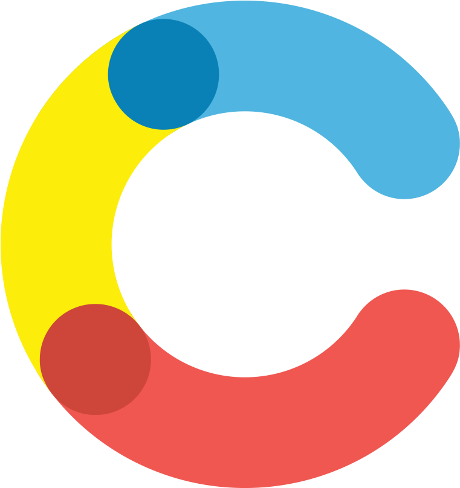

<h1 style="color: #44AEFB; font-family:Arial, sans-serif;" >About me</h1>

👋 Hi there! My name is Mauro Alvarez and I'm an Argentinian-Australian digital nomad with 15+ years of experience building software. 
 
 
I'm passionate about building digital products that scale. My background includes strong knowledge of front-end development (HTML5, CSS, JavaScript, ReactJs), back-end development using Node.js and mobile development using React Native.
 
 
I'm well-organized, able to work well with minimal supervision. I can handle multiple projects and adapt to diverse teams/projects.
 

    

 

<!-- Languages and Tools -->
<h2 style="color: #44AEFB">🧑‍💻 Languages and Tools</h2> 
 

  
  
  
  
  
  
  
  
  
  
  
     
  
  
  
  
  
  
  
  
  
  
  
  
  

 
 

<!-- Statistics -->

<h2 style="color: #44AEFB">Statistics</h2>

<!-- Begin Stats Cards -->
<!-- Resources:  -->
<!-- Github & Languages Stats: https://github.com/alvarezmauro/github-readme-stats -->
<!-- Streak Stats: https://github.com/alvarezmauro/github-readme-streak-stats -->

<!-- compact programming languages layout -->

<!--  End Stats Cards -->

---

<!-- Begin Footer -->

    
    
    

<!-- End Footer -->
